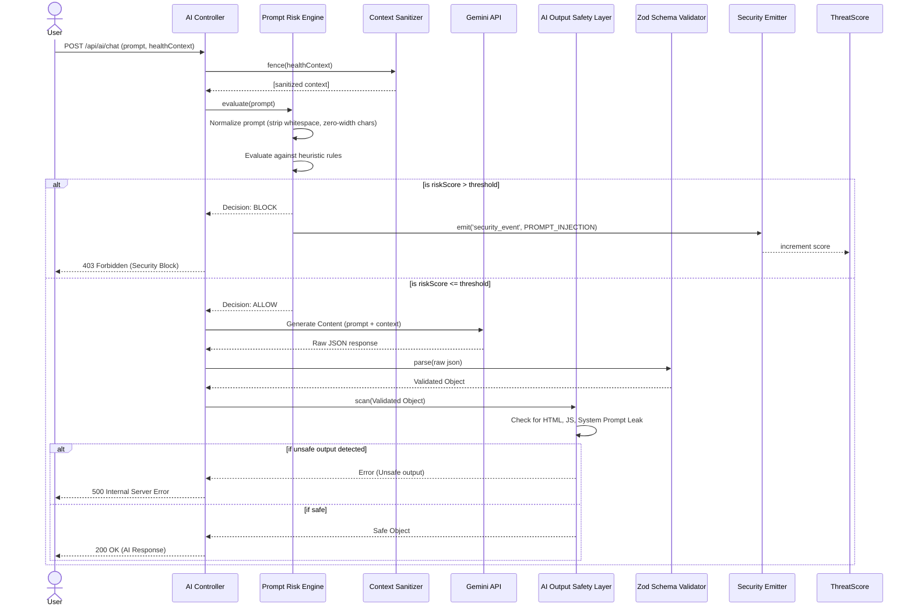

# AI Security Flow

This document details the sequence of events when a user submits a prompt to the AI. It demonstrates how the `PromptRiskEngine`, `ContextSanitizer`, and `AiOutputSafetyLayer` intercept and validate interactions to prevent prompt injection and system leakage.

## Sequence Diagram

