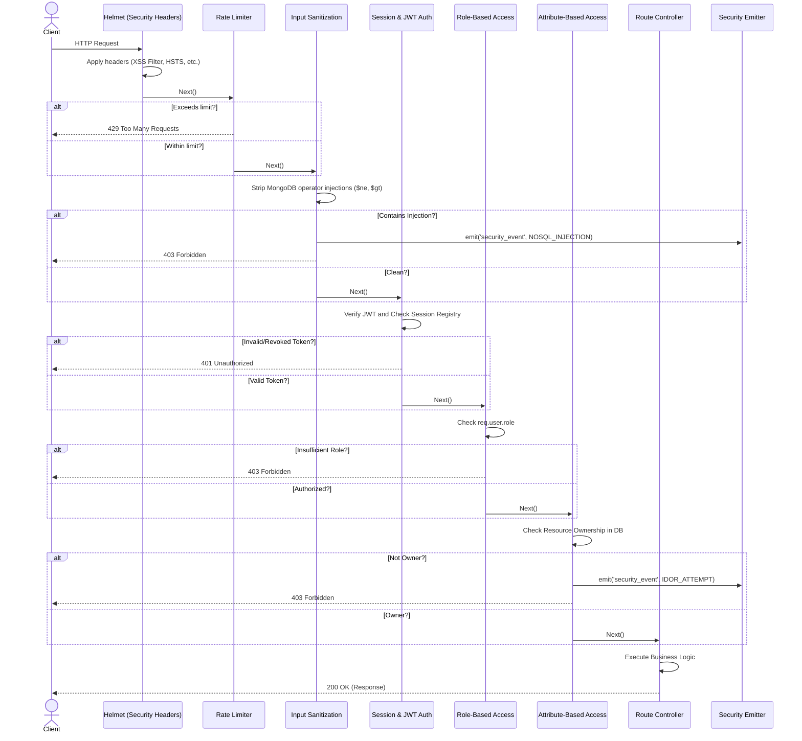

# Request Lifecycle

This sequence diagram illustrates the global request lifecycle for a protected route in SwasthaParivar V2, emphasizing the "Security Floor".

## Sequence Diagram

```mermaid
sequenceDiagram
    actor Client
    participant Helmet as Helmet (Security Headers)
    participant RateLimiter as Rate Limiter
    participant Sanitizer as Input Sanitization
    participant Auth as Session & JWT Auth
    participant RBAC as Role-Based Access
    participant ABAC as Attribute-Based Access
    participant Controller as Route Controller
    participant Emitter as Security Emitter

    Client->>Helmet: HTTP Request
    Helmet->>Helmet: Apply headers (XSS Filter, HSTS, etc.)
    Helmet->>RateLimiter: Next()
    
    alt Exceeds limit?
        RateLimiter-->>Client: 429 Too Many Requests
    else Within limit?
        RateLimiter->>Sanitizer: Next()
    end
    
    Sanitizer->>Sanitizer: Strip MongoDB operator injections ($ne, $gt)
    
    alt Contains Injection?
        Sanitizer->>Emitter: emit('security_event', NOSQL_INJECTION)
        Sanitizer-->>Client: 403 Forbidden
    else Clean?
        Sanitizer->>Auth: Next()
    end
    
    Auth->>Auth: Verify JWT and Check Session Registry
    alt Invalid/Revoked Token?
        Auth-->>Client: 401 Unauthorized
    else Valid Token?
        Auth->>RBAC: Next()
    end
    
    RBAC->>RBAC: Check req.user.role
    alt Insufficient Role?
        RBAC-->>Client: 403 Forbidden
    else Authorized?
        RBAC->>ABAC: Next()
    end
    
    ABAC->>ABAC: Check Resource Ownership in DB
    alt Not Owner?
        ABAC->>Emitter: emit('security_event', IDOR_ATTEMPT)
        ABAC-->>Client: 403 Forbidden
    else Owner?
        ABAC->>Controller: Next()
    end
    
    Controller->>Controller: Execute Business Logic
    Controller-->>Client: 200 OK (Response)
```
