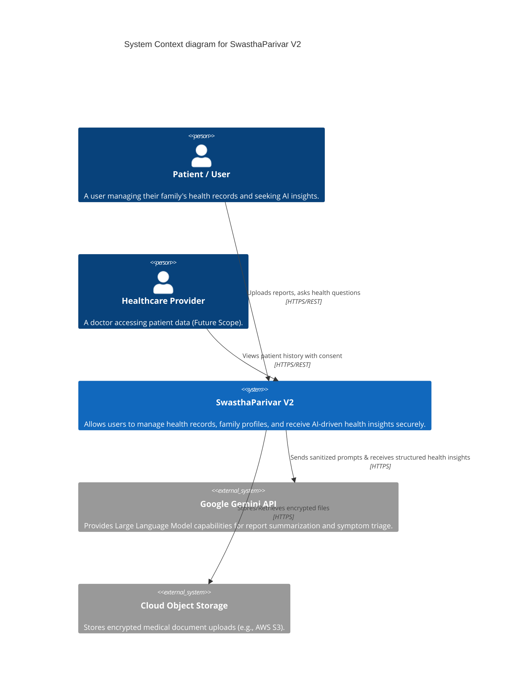
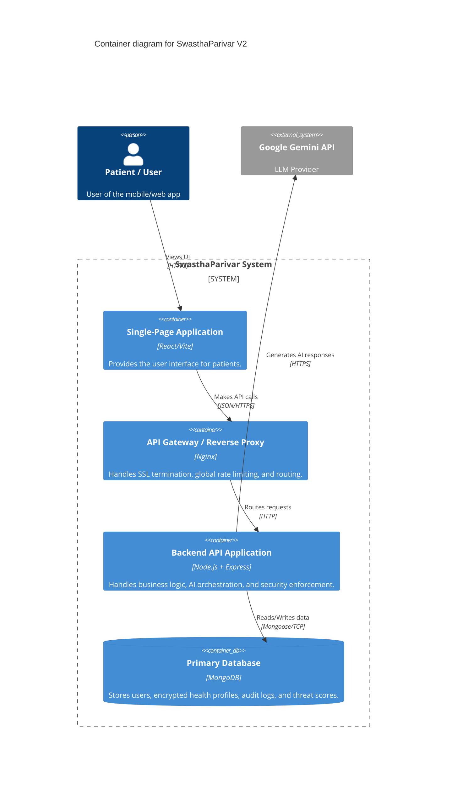

# System Overview: SwasthaParivar V2

## 1. Business Overview
SwasthaParivar V2 is a secure, privacy-first family health management platform designed to empower individuals to track and understand their family's health data. It allows users to digitize medical records (lab reports, prescriptions, scans), track symptoms, manage medications, and receive AI-driven insights into their health data in a highly secure environment. The platform focuses on maintaining absolute patient confidentiality and mitigating threats such as unauthorized access, data leaks, and AI prompt injections.

## 2. Functional Requirements
*   **User & Family Management**: Users can create accounts, manage profiles, and add family members with distinct health profiles.
*   **Medical Record Digitization**: Secure upload and storage of medical documents (PDFs, images).
*   **AI-Powered Insights**: An intelligent assistant capable of reviewing reports, triaging symptoms, and answering health questions based on the user's specific context.
*   **Security & Auditing**: Immutable audit trails for all actions involving Personal Health Information (PHI).
*   **Consent Management**: Granular tracking of user consent for AI processing.

## 3. Non-Functional Requirements
*   **Security (Zero Trust Base)**: All data access must be explicitly authorized. Malicious behavior must be tracked and auto-penalized.
*   **Privacy (HIPAA/GDPR Alignment)**: Sensitive medical data must be encrypted at rest (AES-256-GCM) and in transit.
*   **Scalability**: The backend must handle horizontal scaling seamlessly.
*   **Maintainability**: Code must adhere to Clean Architecture, SOLID principles, and use Factory-based Dependency Injection.
*   **Performance**: AI processing must happen asynchronously where possible to avoid blocking the Node.js event loop.

## 4. Technology Stack
*   **Backend Runtime**: Node.js
*   **Web Framework**: Express.js
*   **Database**: MongoDB (Mongoose ODM)
*   **AI/LLM Provider**: Google Generative AI (Gemini APIs)
*   **Cryptography**: Node.js native `crypto` module (AES-256-GCM, SHA-256)
*   **Validation**: Zod (for strict schema validation of AI outputs and request payloads)
*   **Architecture Pattern**: Clean Architecture with Factory-based Dependency Injection

## 5. Design Principles
*   **Security by Default**: Opt-in data sharing; data is assumed sensitive unless specified otherwise.
*   **Defense in Depth**: Layered security middleware (Helmet -> Rate Limiting -> Sanitization -> Auth -> RBAC -> ABAC).
*   **Fail-Safe Defaults**: If a security check fails or times out, access is denied.
*   **Separation of Concerns**: Controllers handle HTTP logic, Services handle business logic, and Repositories (Models) handle data access.

---

## 6. C4 Model Diagrams

### 6.1 Level 1: System Context Diagram
This diagram shows the high-level interactions between the users, the SwasthaParivar system, and external third-party services.

### 6.2 Level 2: Container Diagram
This diagram zooms into the SwasthaParivar system to show its primary deployable containers and how they interact.

> [!NOTE]
> The C4 Level 3 (Component Diagrams) and detailed application flow will be covered in the subsequent **Application Architecture** and **AI Architecture** documents.
