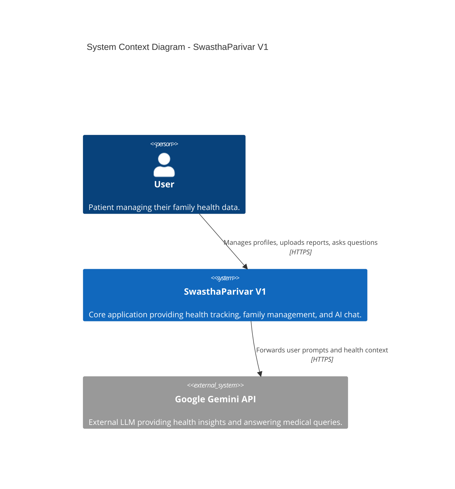
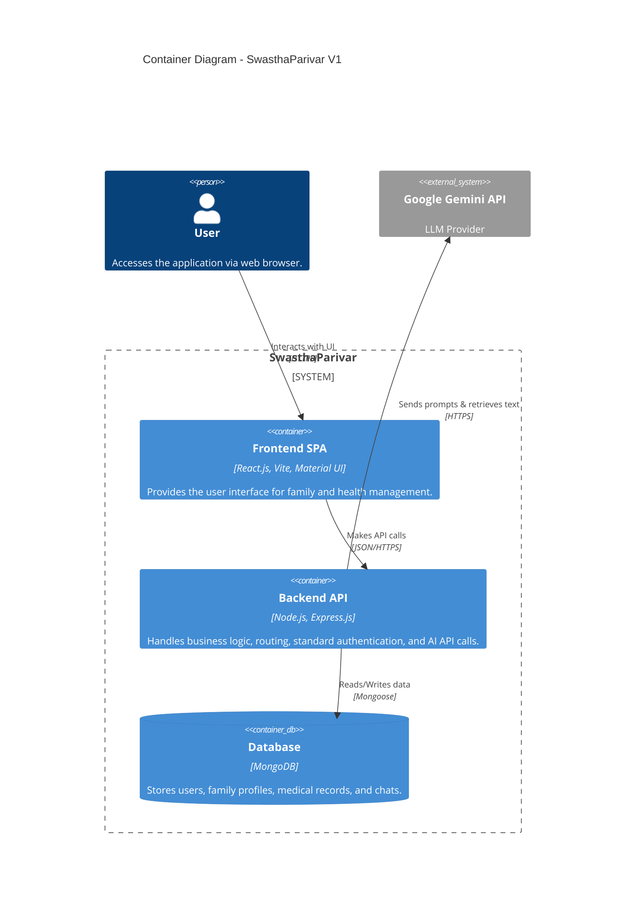
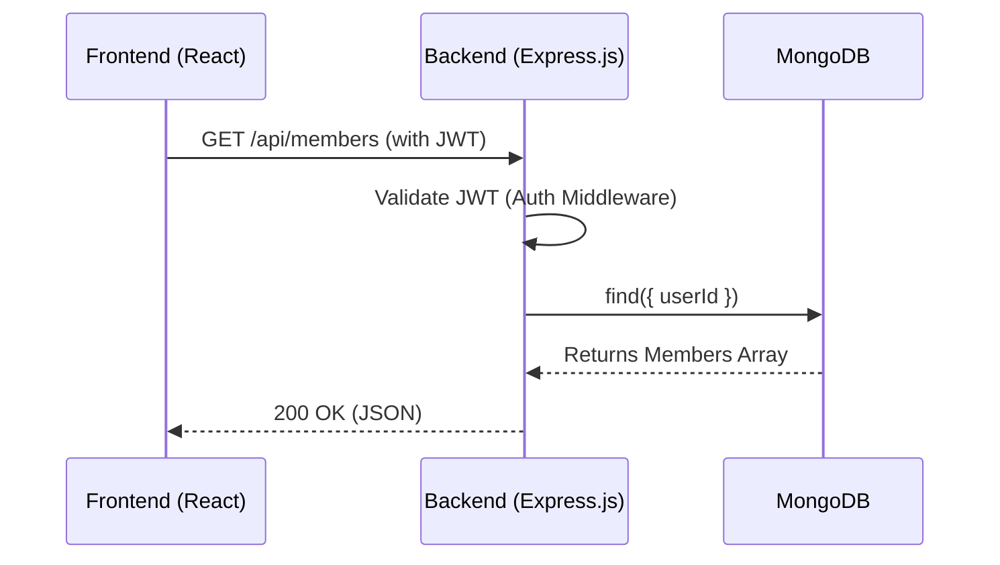
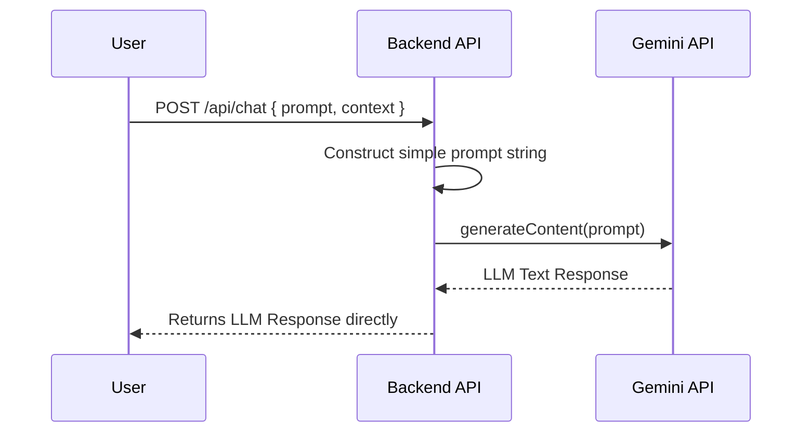
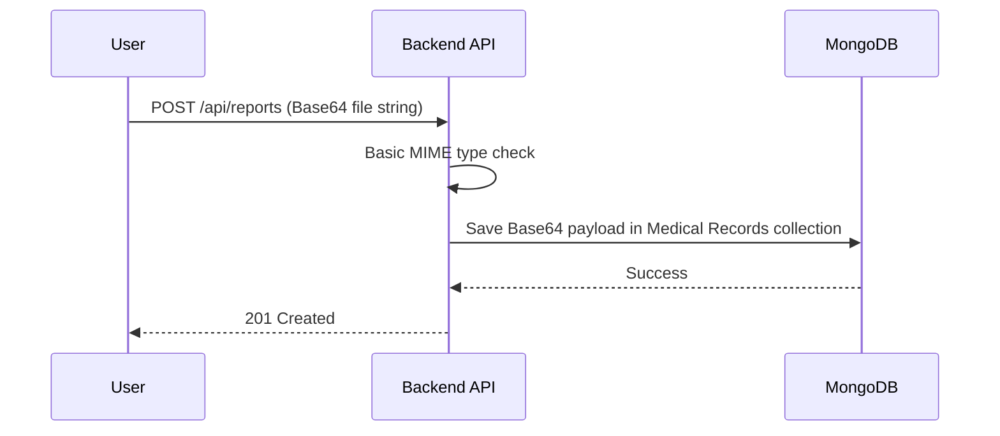

# High-Level System Design (HLD): SwasthaParivar V1

This document outlines the original architecture and system design for SwasthaParivar V1, before the introduction of advanced enterprise security, Zero Trust patterns, or AI safety features.

---

## 1. High-Level Architecture
SwasthaParivar V1 follows a standard monolithic client-server architecture (MERN stack without React Native). The React frontend communicates with a monolithic Express.js REST API, which persists data to MongoDB. The backend also makes external HTTP calls to the Google Gemini API to power the AI Health Chatbot.

## 2. System Context Diagram


## 3. Container Diagram


## 4. Frontend Architecture
*   **Framework**: React.js bundled with Vite.
*   **UI Library**: Material UI (MUI) for rapid component development.
*   **State Management**: React Context / Hooks for managing user sessions and UI state.
*   **Routing**: React Router.
*   **Responsibilities**:
    *   Rendering dashboards and profile management views.
    *   Managing form state for Medical Record uploads.
    *   Maintaining the chat interface for the AI Health Chatbot.
    *   Storing standard JWT tokens in local storage for session persistence.

## 5. Backend Architecture
*   **Framework**: Express.js running on Node.js.
*   **Architecture Pattern**: Basic MVC (Model-View-Controller) / Monolith.
*   **Responsibilities**:
    *   Serving RESTful API endpoints.
    *   Authenticating users via standard JWT implementation.
    *   Storing and retrieving user and family data from MongoDB.
    *   Handling base64 file uploads for medical records.
    *   Acting as a proxy to the Google Gemini API for the chatbot feature.

## 6. Database Design
MongoDB is used as the primary data store, managed via Mongoose schemas.
*   **Users**: Stores user credentials and basic account info.
*   **Members/Profiles**: Stores family members associated with a parent User account.
*   **Medical Records**: Stores references/base64 strings of uploaded reports, linked to specific profiles.
*   **Reminders**: Stores medicine and vaccination reminder schedules.

## 7. API Flow


## 8. AI Chatbot Flow
The AI chatbot in V1 directly forwards user queries and basic health context to the Gemini API without advanced sanitization or prompt injection protection.



## 9. File Upload Flow


## 10. Deployment Architecture
*   **Frontend Environment**: Vercel (CI/CD connected to the GitHub repository for automatic builds).
*   **Backend Environment**: Render (Hosts the Node.js Express server).
*   **Database**: MongoDB Atlas (Cloud-hosted MongoDB).

## 11. Request Lifecycle
1.  **Request Initiation**: The frontend sends an HTTP request (with a JWT in the `Authorization` header) to a Render backend endpoint.
2.  **Basic Middleware**: Express parses the JSON body.
3.  **Authentication**: A simple JWT verification middleware checks the token signature.
4.  **Controller Execution**: The route handler processes the request (e.g., querying MongoDB).
5.  **Response**: A JSON payload is returned to the frontend.

## 12. Sequence Diagrams
*(Included natively in sections 7, 8, and 9 above for context-specific flows).*

## 13. Folder Structure
A traditional flat MVC structure:
```text
/src
  /controllers     # HTTP request handlers
  /models          # Mongoose schemas
  /routes          # Express router definitions
  /middleware      # Basic JWT auth middleware
  /utils           # Helper functions
  server.js        # Express app entry point
```

---

## Known Limitations of V1

This architecture represents an early MVP phase of SwasthaParivar. It lacks several critical layers necessary for a secure, enterprise-grade healthcare application:

*   **Enterprise Security**: Lacks a comprehensive "Security Floor" (no advanced Helmet configurations, rate limiting, or request sanitization).
*   **AI Security**: The chatbot directly passes user input to the LLM, making it highly vulnerable to Prompt Injections, system prompt leakage, and jailbreaks. There is no AI Output Safety Layer to prevent malicious code or dangerous medical advice from being returned to the user.
*   **Advanced Authorization**: Relies entirely on basic JWT validation without robust Role-Based Access Control (RBAC) or Attribute-Based Access Control (ABAC) to strictly enforce resource ownership, leaving the system vulnerable to Insecure Direct Object Reference (IDOR) attacks.
*   **Encryption at Rest**: Personal Health Information (PHI) and medical records are stored in plaintext in the database. If the database is compromised, sensitive medical data is entirely exposed.
*   **Threat Detection**: No mechanisms exist to detect, track, or auto-suspend malicious actors aggressively probing the system.
*   **Audit Logging**: The system does not maintain tamper-evident audit trails for when sensitive medical records are accessed, created, or deleted.
*   **Privacy Controls**: Lacks granular, versioned consent management for users to opt-in or opt-out of their data being processed by external AI providers.
